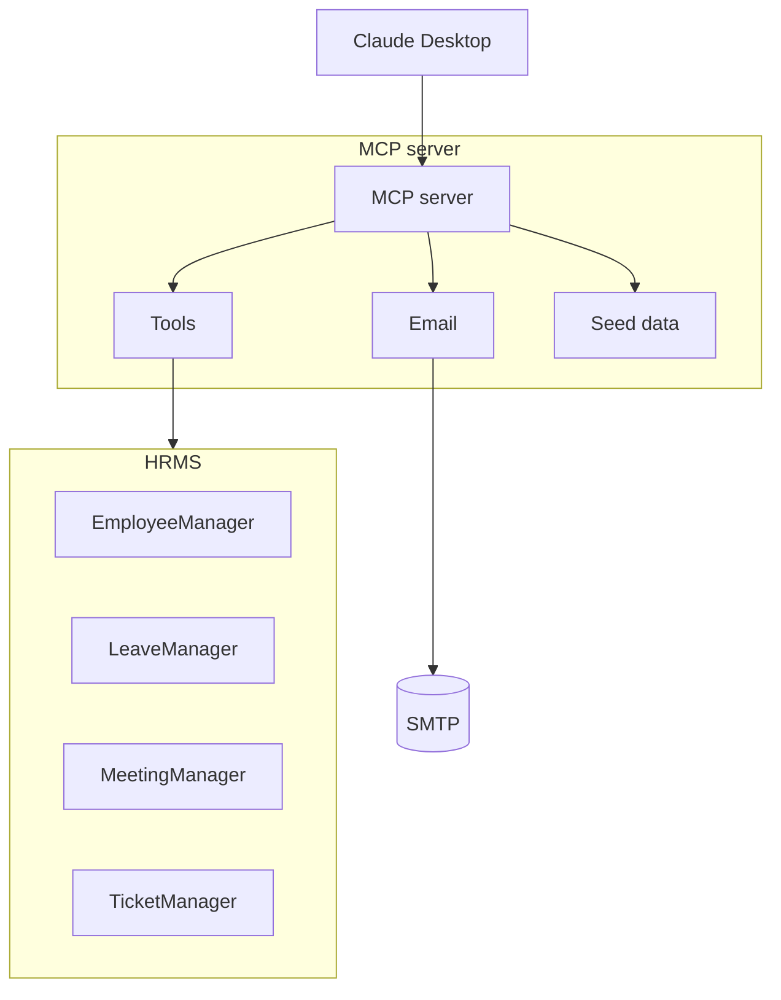

# HR-ASSIST Agentic MCP Server for HR Workflows

HR-ASSIST is an agentic AI MCP server that exposes HR operations as MCP tools so that an MCP-capable client such as Claude Desktop can drive HR workflows like onboarding, ticket creation, meeting scheduling, and leave management.

This project demonstrates how an AI agent can execute HR processes end-to-end using MCP (Model Context Protocol). The HRMS data is seeded in memory, and emails are sent via Gmail SMTP. The intent is to illustrate the full flow even when you don’t have access to paid HRMS APIs like Keka or enterprise Outlook.

---

## Table of Contents

1. [What this project is](#what-this-project-is)  
2. [How to use the system](#how-to-use-the-system)  
3. [Architecture](#architecture)  
4. [Repository structure](#repository-structure)  
5. [Prerequisites](#prerequisites)  
6. [Configure Claude Desktop](#configure-claude-desktop)  
7. [Environment variables](#environment-variables)  
8. [MCP tools](#mcp-tools)  
9. [Onboarding flow](#onboarding-flow)  
10. [Notes and limitations](#notes-and-limitations)

---

## 1. What this project is

This repository contains:

- `server.py`: MCP server that registers HR tools using FastMCP  
- `HRMS/`: in-memory HR management layer (employees, leave, meetings, tickets)  
- `utils.py`: seeds HRMS services with sample data  
- `emails.py`: sends emails via Gmail using SMTP  
- `pyproject.toml`: declares dependencies (`mcp[cli] >= 1.19.0`)  

The data is stored in memory and reset each time the server restarts. Once integrated with a real HRMS such as Keka, you can replace the in-memory logic with actual API calls.

---

## 2. How to use the system

You do **not** start by running `python server.py`.

Instead, open **Claude Desktop** and configure it to recognize this MCP server. Once configured, Claude Desktop will list all available tools from HR-ASSIST and call them when prompted.

### Example interaction

1. Open Claude Desktop  
2. Configure MCP (explained below)  
3. Restart Claude Desktop  
4. Ask Claude:  
   > Onboard Jane Doe under Sarah Johnson  

Claude will automatically call this MCP server via stdio, execute the tools, and return results (employee creation, tickets, meeting scheduling, and welcome email).

---

## 3. Architecture

The system has three main layers:

**Client** — Claude Desktop (the reasoning layer)  
**Server** — MCP server (`server.py`) exposing HR tools  
**Service Layer** — HRMS managers (`HRMS/`) storing and managing HR data




---

## 4. Repository structure

```text
rohan0497-hr-assist/
├── README.md
├── emails.py
├── main.py
├── pyproject.toml
├── server.py
├── utils.py
├── .python-version
└── HRMS/
    ├── __init__.py
    ├── employee_manager.py
    ├── leave_manager.py
    ├── meeting_manager.py
    ├── schemas.py
    └── ticket_manager.py
```

---

## 5. Prerequisites

- Python 3.11  
- Claude Desktop installed  
- Gmail account with app password (for SMTP)  
- Ability to edit Claude Desktop MCP configuration  

Dependencies (from `pyproject.toml`):

```toml
mcp[cli] >= 1.19.0
python-dotenv
```

---

## 6. Configure Claude Desktop

Edit your Claude Desktop MCP configuration file and add:

```json
{
  "mcpServers": {
    "hr-assist": {
      "command": "python",
      "args": ["server.py"],
      "cwd": "C:\\path\\to\\rohan0497-hr-assist",
      "env": {
        "CB_EMAIL": "your_email@example.com",
        "CB_EMAIL_PWD": "your_app_password"
      }
    }
  }
}
```

After saving, **restart Claude Desktop**.  
Then open the **Tools** tab and confirm that `hr-assist` appears in the list.  
You don’t need to run any Python commands manually. Claude will manage that.

---

## 7. Environment variables

You have to use a `.env` file and define them in Claude’s config.

Example `.env` file:

```env
CB_EMAIL=your_email@example.com
CB_EMAIL_PWD=your_app_password
```

These values are loaded automatically using:

```python
from dotenv import load_dotenv
load_dotenv()
```


---

## 8. MCP tools

Defined in `server.py`:

- `add_employee(emp_name, manager_id, email)`  
- `get_employee_details(name)`  
- `send_email(to_emails, subject, body, html=False)`  
- `create_ticket(emp_id, item, reason)`  
- `update_ticket_status(ticket_id, status)`  
- `list_tickets(employee_id, status)`  
- `schedule_meeting(employee_id, meeting_datetime, topic)`  
- `get_meetings(employee_id)`  
- `cancel_meeting(employee_id, meeting_datetime, topic)`  
- `get_employee_leave_balance(emp_id)`  
- `apply_leave(emp_id, leave_dates)`  
- `get_leave_history(emp_id)`  

### Prompt

```python
@mcp.prompt("onboard_new_employee")
def onboard_new_employee(employee_name: str, manager_name: str):
    ...
```

This tells Claude how to structure an onboarding sequence (add employee, send email, raise tickets, schedule meeting).

---

## 9. Onboarding flow

1. Open Claude Desktop  
2. Confirm MCP config includes `hr-assist`  
3. Restart Claude Desktop  
4. Claude automatically loads tools  
5. Give Claude this prompt:  
   > Onboard Rohan Verma under Sarah Johnson  
6. Claude calls:
   - `add_employee`
   - `send_email`
   - `create_ticket`
   - `schedule_meeting`  
7. You can then ask:
   > list tickets for Rohan Verma  
   > show meetings for the new employee

Everything is handled inside Claude Desktop, you never run the server manually.

---

## 10. Notes and limitations

- Data is in-memory and resets when the server restarts  
- Demonstrates MCP workflow, not a production HRMS  
- Keka or Outlook APIs can replace the mock layers later  
- Claude Desktop = reasoning agent  
- This repo = actionable backend for HR operations  

---
Credits : Codebasics