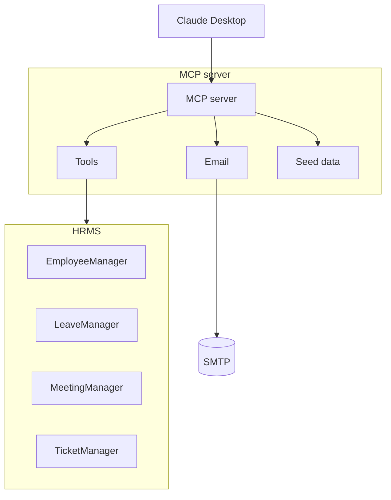

# HR-ASSIST Agentic MCP Server for HR Workflows

HR-ASSIST is an agentic AI MCP server that exposes HR operations as MCP tools so that an MCP-capable client such as Claude Desktop can drive HR workflows like onboarding, ticket creation, meeting scheduling, and leave management.

This project demonstrates how an AI agent can execute HR processes end-to-end using MCP (Model Context Protocol). The HRMS data is seeded in memory, and emails are sent via Gmail SMTP. The intent is to illustrate the full flow even when you don’t have access to paid HRMS APIs like Keka or enterprise Outlook.

---


## Table of Contents

- [What this project is](#what-this-project-is)
- [How to use the system](#how-to-use-the-system)
- [Architecture](#architecture)
- [Repository structure](#repository-structure)
- [Prerequisites](#prerequisites)
- [Configure Claude Desktop](#configure-claude-desktop)
- [Environment variables](#environment-variables)
- [MCP tools](#mcp-tools)
- [Onboarding flow](#onboarding-flow)
- [Notes and limitations](#notes-and-limitations)


---

## What this project is

This repository contains:

- `server.py`: MCP server that registers HR tools using FastMCP  
- `HRMS/`: in-memory HR management layer (employees, leave, meetings, tickets)  
- `utils.py`: seeds HRMS services with sample data  
- `emails.py`: sends emails via Gmail using SMTP  
- `pyproject.toml`: declares dependencies (`mcp[cli] >= 1.19.0`)  

The data is stored in memory and reset each time the server restarts. Once integrated with a real HRMS such as Keka, you can replace the in-memory logic with actual API calls.

---

## How to use the system

You do **not** start by running `python server.py`.

Instead, open **Claude Desktop** and configure it to recognize this MCP server. Once configured, Claude Desktop will list all available tools from HR-ASSIST and call them when prompted.

### Example interaction

1. Open Claude Desktop  
2. Configure MCP (explained below)  
3. Restart Claude Desktop  
4. Ask Claude:  
   > Onboard Jane Doe under Sarah Johnson  

Claude will automatically call this MCP server via stdio, execute the tools, and return results (employee creation, tickets, meeting scheduling, and welcome email).

---

## Architecture

The system has three main layers:

**Client** — Claude Desktop (the reasoning layer)  
**Server** — MCP server (`server.py`) exposing HR tools  
**Service Layer** — HRMS managers (`HRMS/`) storing and managing HR data




---

## Repository structure

```text
rohan0497-hr-assist/
├── README.md
├── emails.py
├── main.py
├── pyproject.toml
├── server.py
├── utils.py
├── .python-version
└── HRMS/
    ├── __init__.py
    ├── employee_manager.py
    ├── leave_manager.py
    ├── meeting_manager.py
    ├── schemas.py
    └── ticket_manager.py
```

---

## Prerequisites

- Python 3.11  
- Claude Desktop installed  
- Gmail account with app password (for SMTP)  
- Ability to edit Claude Desktop MCP configuration  

Dependencies (from `pyproject.toml`):

```toml
mcp[cli] >= 1.19.0
python-dotenv
```

---

## Local setup and dependency installation

1. **Clone the repo and create a virtual environment**
   ```powershell
   git clone https://github.com/your-org/hr-assist.git
   cd hr-assist
   python -m venv .venv
   ```
   Activate it with `.venv\Scripts\activate` on Windows or `source .venv/bin/activate` on macOS/Linux.

2. **Install the dependencies declared in `pyproject.toml`**
   - Recommended (`uv` respects `uv.lock` for deterministic installs):
     ```bash
     pip install --upgrade uv
     uv sync
     ```
   - Plain `pip` fallback:
     ```bash
     python -m pip install --upgrade pip
     pip install -e .
     ```
     (Pip will read the dependency metadata directly from `pyproject.toml`.)

3. **Generate a `requirements.txt` when another environment needs it**
   ```bash
   uv pip freeze > requirements.txt
   ```
   Commit or share that file only if another runtime specifically requires `pip install -r requirements.txt`. Re-run the command whenever you change dependencies so the export stays in sync with `pyproject.toml`/`uv.lock`.

---

## Repo hygiene files


If you modify dependencies in `pyproject.toml`, run `uv sync` (or `pip install -e .`) to refresh the environment and then regenerate the export so downstream users can keep up:

```bash
uv pip freeze > requirements.txt
```

Commit the updated `requirements.txt` only when its contents change alongside the `pyproject.toml`/`uv.lock` edits so everything stays consistent.

---

## Configure Claude Desktop

Edit your Claude Desktop MCP configuration file and add:

```json
{
  "mcpServers": {
    "hr-assist": {
      "command": "python",
      "args": ["server.py"],
      "cwd": "C:\\path\\to\\rohan0497-hr-assist",
      "env": {
        "CB_EMAIL": "your_email@example.com",
        "CB_EMAIL_PWD": "your_app_password"
      }
    }
  }
}
```

After saving, **restart Claude Desktop**.  
Then open the **Tools** tab and confirm that `hr-assist` appears in the list.  
You don’t need to run any Python commands manually. Claude will manage that.

---

## Environment variables

HR-ASSIST needs Gmail credentials for SMTP. Provide them using **one** of the options below so you are not duplicating secrets in multiple places:

- **Option A  `.env` file for local development.** Store `CB_EMAIL` and `CB_EMAIL_PWD` in a local `.env`. `python-dotenv` loads it whenever `server.py` starts, so secrets stay out of the Claude config while you test locally.
- **Option B  Claude Desktop MCP config.** Add the same variables under the Claude MCP `env` block. Claude injects them into the process environment each time it launches the server.

`load_dotenv()` runs with its default `override=False`, so anything Claude already sets wins. If both sources define the same key, the Claude/Desktop config takes precedence. Pick a single source of truth per environment (e.g., `.env` while developing, Claude config in production) to avoid confusion.

Example `.env` file:

```env
CB_EMAIL=your_email@example.com
CB_EMAIL_PWD=your_app_password
```

```python
from dotenv import load_dotenv
load_dotenv()
```

---

## MCP tools

Defined in `server.py`:

- `add_employee(emp_name, manager_id, email)`  
- `get_employee_details(name)`  
- `send_email(to_emails, subject, body, html=False)`  
- `create_ticket(emp_id, item, reason)`  
- `update_ticket_status(ticket_id, status)`  
- `list_tickets(employee_id, status)`  
- `schedule_meeting(employee_id, meeting_datetime, topic)`  
- `get_meetings(employee_id)`  
- `cancel_meeting(employee_id, meeting_datetime, topic)`  
- `get_employee_leave_balance(emp_id)`  
- `apply_leave(emp_id, leave_dates)`  
- `get_leave_history(emp_id)`  

### Prompt

```python
@mcp.prompt("onboard_new_employee")
def onboard_new_employee(employee_name: str, manager_name: str):
    ...
```

This tells Claude how to structure an onboarding sequence (add employee, send email, raise tickets, schedule meeting).

---

## Onboarding flow

1. Open Claude Desktop  
2. Confirm MCP config includes `hr-assist`  
3. Restart Claude Desktop  
4. Claude automatically loads tools  
5. Give Claude this prompt:  
   > Onboard Rohan Verma under Sarah Johnson  
6. Claude calls:
   - `add_employee`
   - `send_email`
   - `create_ticket`
   - `schedule_meeting`  
7. You can then ask:
   > list tickets for Rohan Verma  
   > show meetings for the new employee

Everything is handled inside Claude Desktop, you never run the server manually.

### Example output


- Click on the `+` icon and select the `Add from hr-assist` option, and send the request.
- Fill the details for the new employee:


Alternatively, you can draft a custom prompt and let the agent take over.

You can also confirm visually inside Claude’s tool pane. The screenshot below (stored at `resources/image.jpg`) shows the full onboarding checklist completed end-to-end:


---

## Notes and limitations

- Data is in-memory and resets when the server restarts  
- Demonstrates MCP workflow, not a production HRMS  
- Keka or Outlook APIs can replace the mock layers later  
- Claude Desktop = reasoning agent  
- This repo = actionable backend for HR operations  

---
Credits : Codebasics
