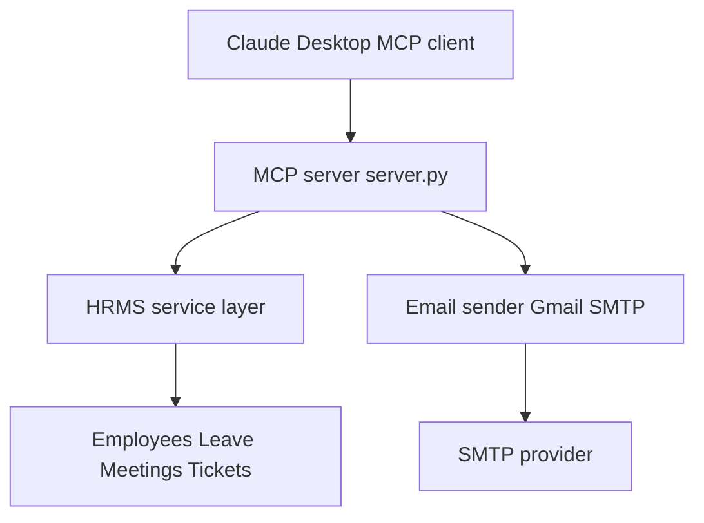

# HR-ASSIST Agentic MCP Server for HR Workflows

HR-ASSIST is an agentic AI backend that exposes HR operations such as employee onboarding, leave, meetings, tickets and email notifications as MCP tools. It is designed to be called by an MCP capable client such as Claude Desktop. The client becomes the reasoning layer and this repository becomes the action layer.

This implementation uses in-memory HRMS services that are seeded on startup. This is intentional. Most real onboarding platforms such as Keka expose their APIs only on paid plans and Outlook or Microsoft Graph based email flows are also typically paid or enterprise. For this demo we show the exact structure using seeded data and Gmail SMTP. With a real platform such as Keka you can load their API straight from their documentation and call it directly using their syntax instead of the in-memory syntax shown here.

The goal of this README is that a new person should be able to clone the repository, configure Claude Desktop, provide email credentials, start the MCP server and run the onboarding workflow end to end.

## Table of Contents

1. Project description
2. Architecture
3. Repository structure
4. Prerequisites
5. Installation and setup
6. Claude Desktop configuration
7. Environment variables and secrets
8. Running the server
9. MCP tools exported by the server
10. Onboarding flow explained
11. Extending the system
12. Troubleshooting
13. Notes and limitations
14. Quick start

## Project description

This repository contains an MCP server written in Python. The server file is server.py. The server uses FastMCP to expose multiple tools. These tools delegate work to the HRMS package which contains managers for employees, tickets, meetings and leave. The utils.py file seeds these managers with coherent sample data so that the MCP client can immediately query and mutate data.

The design is intentionally simple. There is no database. There is no external HR system. Data is held in memory and created at runtime. This makes the project self contained and easy to demo.

The email feature is implemented in emails.py. It uses Gmail SMTP through environment variables CB_EMAIL and CB_EMAIL_PWD. This mirrors how a real MCP server would send emails after onboarding a new employee.

## Architecture

The system can be described in three layers.

Client layer  
This is Claude Desktop or any MCP compliant client. The user types a prompt such as Onboard Jane Doe under Sarah Johnson. The client decides which MCP tools to call.

MCP server layer  
This is server.py in this repository. It receives calls over stdio from the MCP client. It exposes tools like add_employee, send_email, create_ticket, schedule_meeting. It also exposes a prompt template called onboard_new_employee that guides the agent on which tools to call and in what order.

Service layer  
This is the HRMS package. It contains EmployeeManager, LeaveManager, MeetingManager, TicketManager and Pydantic schemas. The MCP tools call these managers. The managers operate on seeded in-memory data.

### Architecture diagram in Mermaid



This diagram is deliberately simple so that GitHub renders it. If your environment supports more advanced Mermaid features you can expand this into subgraphs.

## Repository structure

```text
└── rohan0497-hr-assist/
    ├── README.md
    ├── emails.py
    ├── main.py
    ├── pyproject.toml
    ├── server.py
    ├── utils.py
    ├── .python-version
    └── HRMS/
        ├── __init__.py
        ├── employee_manager.py
        ├── leave_manager.py
        ├── meeting_manager.py
        ├── schemas.py
        └── ticket_manager.py
```

README.md will be replaced by this document.  
emails.py contains the Gmail SMTP sender.  
server.py is the MCP server entry point.  
utils.py seeds employees, meetings, leave and tickets.  
HRMS contains the service logic.

## Prerequisites

Python 3.11  
Claude Desktop installed locally  
A Gmail or Google Workspace mailbox that can send email via SMTP  
App password if Gmail account has two factor authentication  
Ability to edit Claude Desktop configuration

The project depends on mcp[cli] 1.19.0 or newer.

## Installation and setup

1. Clone the repository

```bash
git clone <your-path-or-fork>/rohan0497-hr-assist.git
cd rohan0497-hr-assist
```

2. Create and activate a virtual environment

```bash
python -m venv .venv
source .venv/bin/activate
# .venv\Scripts\activate   on Windows
```

3. Install dependencies

```bash
pip install "mcp[cli]>=1.19.0" python-dotenv
```

## Claude Desktop configuration

Add an MCP server entry in the Claude Desktop configuration file.

Example:

```json
{
  "mcpServers": {
    "hr-assist": {
      "command": "python",
      "args": [
        "server.py"
      ],
      "cwd": "C:\\\\code\\\\rohan0497-hr-assist",
      "env": {
        "CB_EMAIL": "your_email@example.com",
        "CB_EMAIL_PWD": "your_app_password"
      }
    }
  }
}
```

Change cwd and command for your machine.  
After editing the configuration restart Claude Desktop so that it reloads the MCP servers. Then open Tools and check that hr-assist is visible.

## Environment variables and secrets

The server loads environment values using python-dotenv. That means you can either create a .env file or push the variables through the Claude configuration.

Example .env

```env
CB_EMAIL=your_email@example.com
CB_EMAIL_PWD=your_app_password
```

Then run

```bash
python server.py
```

Alternatively put the same keys in the env block in Claude Desktop as in the JSON above.

The emails.py file and the default server configuration expect Gmail

smtp.gmail.com  
port 587  
TLS enabled

To use Outlook or another provider change the constructor in emails.py and in server.py. Outlook and some HR platforms often require paid or enterprise plans which is why this demo uses Google accounts.

## Running the server

From the project root

```bash
python server.py
```

This will start the MCP server on stdio. Keep it running. Now open Claude Desktop and trigger a tool or run the onboarding prompt.

You can verify that Python is set up correctly by running

```bash
python main.py
```

which simply prints Hello from hr-assist.

## MCP tools exported by the server

add_employee  
Creates a new employee in the in-memory HRMS. It uses EmployeeManager.get_next_emp_id to generate ids.

get_employee_details  
Looks up an employee by name using fuzzy matching.

send_email  
Sends an email to the specified recipients using the Gmail SMTP credentials.

create_ticket  
Creates a ticket for equipment or access for an employee.

update_ticket_status  
Changes the status of a ticket to Open, In Progress, Closed or Rejected.

list_tickets  
Lists tickets for an employee and can filter by status.

schedule_meeting  
Creates a meeting entry for an employee.

get_meetings  
Returns meetings for an employee.

cancel_meeting  
Deletes a meeting that matches the employee and datetime.

get_employee_leave_balance  
Shows current leave balance.

apply_leave  
Creates leave entries and reduces balance.

get_leave_history  
Returns the history of leaves.

There is also the MCP prompt onboard_new_employee which returns a full set of instructions to the client so that it can call the above tools in sequence.

## Onboarding flow explained

1. User downloads and installs Claude Desktop.
2. User edits the Claude configuration to add the hr-assist MCP server and restarts Claude.
3. User opens Claude, selects tools, and chooses the hr-assist tools.
4. User writes a prompt like Onboard Anita Sharma under Sarah Johnson.
5. Claude calls the onboard_new_employee prompt on the MCP server.
6. The prompt instructs the agent to do all steps. These steps are add the employee, send a welcome email, notify the manager, create tickets for laptop and ID card and schedule an introductory meeting.
7. The server uses seeded in-memory data for managers, existing employees and tickets. This is done because onboarding platforms such as Keka expose their APIs on paid versions and because we are using Google SMTP instead of Outlook which is also a paid or enterprise flow. The structure here is exactly what you would use with Keka. The only difference is that with Keka you can directly load their API from the website or their Postman collection and call their syntax instead of the in-memory syntax used here.

## Extending the system

Create a new manager in HRMS if you need a new capability.  
Expose a new MCP tool in server.py using the @mcp.tool() decorator.  
Optionally modify the onboard_new_employee MCP prompt to call your new tool so that the agent is aware of it.  
Because Claude is the caller you do not have to change the client code.

## Troubleshooting

If you get ModuleNotFoundError for emails then verify that emails.py is present in the project root. The sample emails.py from this repository is enough for local runs.

If email is not delivered verify CB_EMAIL and CB_EMAIL_PWD. For Gmail you may need to generate an app password.

If hr-assist does not appear in Claude then run python server.py yourself and see if it crashes. Fix any import errors. Then restart Claude.

If meeting creation fails it is because the in-memory MeetingManager prevents two meetings with exactly the same datetime for the same employee.

If Claude does not run your new tool check that you restarted Claude after editing the MCP configuration.

## Notes and limitations

Data is stored in memory and is lost when the server stops.  
This project is meant to show structure for an MCP based HR assistant.  
For real systems replace HRMS calls with real API calls such as Keka, BambooHR or custom onboarding services.  
For real email flows replace Gmail SMTP with Outlook or Graph once you have a paid setup.  
Transport is stdio and is suitable for Claude Desktop.

## Quick start

1. Clone rohan0497-hr-assist
2. Create .env with CB_EMAIL and CB_EMAIL_PWD
3. Install dependencies
4. Run python server.py
5. Configure Claude Desktop and restart it
6. Choose hr-assist in Tools
7. Run the onboarding prompt

After these steps the MCP client will be able to create employees, send emails, raise tickets and schedule meetings using this repository.
